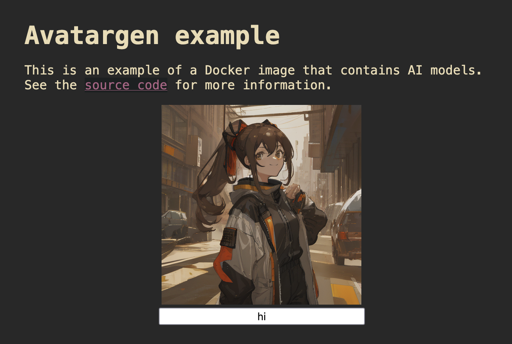

# AI model storage in docker images example

AI models are big and downloading them at runtime can suck. What if you could just put them in your image in the first place? This example shows you how to do that with [your own Docker registry](https://www.tigrisdata.com/docs/apps/docker-registry/) on top of Tigris.

This example is built on top of [ComfyUI](https://www.comfy.org/). It generates placeholder avatar images in the style of [Gravatar](https://docs.gravatar.com/api/avatars/images/) and can be used as a drop-in replacement for Gravatar in your web applications.

## Docker registry

Follow the directions [to create your own Docker registry](https://www.tigrisdata.com/docs/apps/docker-registry/) on top of Tigris. The domain name of your registry is where you will push images to. In this article, I'll refer to this registry host as `registry.domain.tld`.

### Building the base runner image

Build and push the ComfyUI image:

```text
docker build -t registry.domain.tld/base/comfyui comfyui
docker push registry.domain.tld/base/comfyui
```

### Building model images

I've put all the models for this demo in the public bucket `xe-models`. If you want to use your own models, upload them into a bucket [with the directory structure ComfyUI expects](https://docs.comfy.org/essentials/core-concepts/models). Then build and push all of the model images:

```text
cd models
DOCKER_REGISTRY=registry.domain.tld bash fetch-and-build.sh
```

### Building avatargen image

Go into the `server` folder and run this command on the Dockerfile:

```bash
cat Dockerfile | sed 's$docker-auth-registry-dev.fly.dev$registry.domain.tld$g' > Dockerfile.run
```

Then build and push your image:

```text
docker build -t registry.domain.tld/apps/avatargen --file Dockerfile.run .
docker push registry.domain.tld/apps/avatargen
```

## Deploying

- Choose a deployment target with a GPU that has at least 16 Gi of vram
- Create bucket for generated images
- Create access keypair
- Make sure your deployment environment has read access to your registry
- Envvars for deployment

| Name                    | Description                                              |
| :---------------------- | :------------------------------------------------------- |
| `AWS_ACCESS_KEY_ID`     | Your Tigris access key ID (`tid_`)                       |
| `AWS_SECRET_ACCESS_KEY` | Your Tigris secret access key (`tsec_`)                  |
| `AWS_ENDPOINT_URL_S3`   | Set this to `https://fly.storage.tigris.dev` for Tigris. |
| `AWS_REGION`            | Set this to `auto` for Tigris.                           |
| `BUCKET_NAME`           | Where avatar images should be cached.                    |

- Visit the url
  - Screenshot the demo

When it's up, the demo should look like this:



Type words into the text box, wait a few seconds, and the computer will surprise you!
